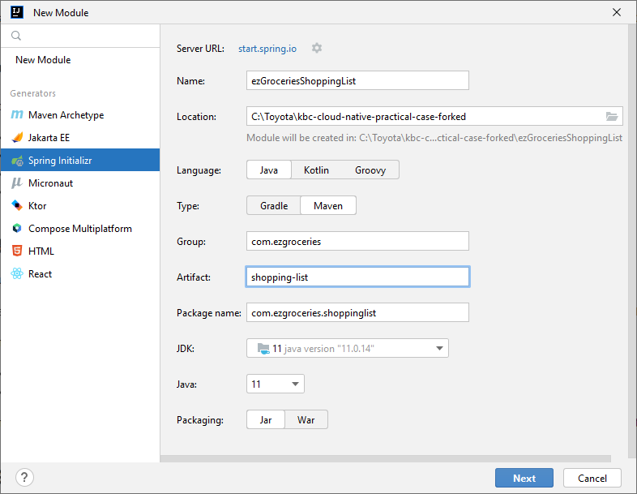

# Lab 01 - Spring Boot

In the root folder of this project, create a Spring Boot application module that will later serve our ``ezGroceries`` API. We will start out minimalistic and gradually add dependencies and capabilities in each lab.

In this introductory lab we want to focus on making sure the application starts successfully and serves the Spring Boot Actuator endpoints.

## Create the new project

From Intellij, choose ``File`` > ``New`` > ``Module...`` and fill the details as shown in the below screenshot:



Then click ``Next`` and add the dependencies
* Spring Web
* Spring Boot Actuator

**NOTE**: take the latest Spring Boot version in the ``2.7`` version range.


Click ``Create`` and wait for Intellij to complete the project:


## Run

Open the ``EzGroceriesShoppingListApplication`` class and run the ``main`` method.
Inspect the console output and make sure the below lines are displayed:
```
2022-10-11 14:28:45.101  INFO 20572 --- [           main] o.s.b.w.embedded.tomcat.TomcatWebServer  : Tomcat started on port(s): 8080 (http) with context path ''
2022-10-11 14:28:45.112  INFO 20572 --- [           main] c.e.s.EzGroceriesShoppingListApplication : Started EzGroceriesShoppingListApplication in 1.561 seconds (JVM running for 2.688)
```
Open your browser and navigate to http://localhost:8080/actuator, it must return the ``JSON`` response:

```json
{
  "_links": {
    "self": {
      "href": "http://localhost:8080/actuator",
      "templated": false
    },
    "health": {
      "href": "http://localhost:8080/actuator/health",
      "templated": false
    },
    "health-path": {
      "href": "http://localhost:8080/actuator/health/{*path}",
      "templated": true
    }
  }
}
```

## Testing

A basic ``EzGroceriesShoppingListApplicationTests`` class has been created, it verifies that the Spring application context can be created.
Run it from Intellij and verify it's successful.

## Commit and tag

Commit your work: use the lab name as comment and [tag](https://www.jetbrains.com/help/idea/use-tags-to-mark-specific-commits.html) it with the same name. Don't forget to push to Github.
