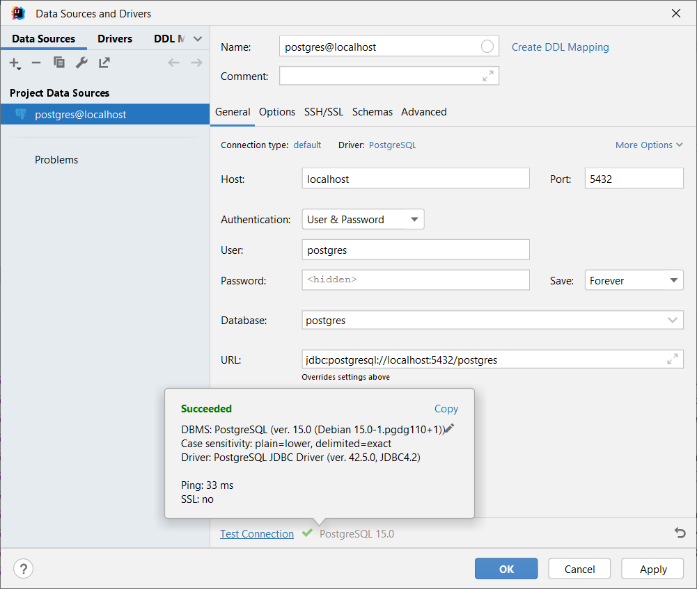

# Lab 05 - Persistence Capability
For implementing our Shopping List functionality we will need some kind of persistence. In this lab we're first going to
add the technical capability of talking to a database from our Spring Boot app.

We'll choose ``Postgres`` as a common database solution.

## Run Postgres locally

**Question**: is this possible / allowed on a KBC Macbook?

When developing locally we'll run ``Postgres`` through a docker container, this can be easily done by running the below
command. The first time we run this, the ``postgres`` docker image will be downloaded:

``docker run -e POSTGRES_PASSWORD=mysecretpassword -p 5432:5432 -d postgres``

Example successful output:

```
Unable to find image 'postgres:latest' locally
latest: Pulling from library/postgres
6ae821421a7d: Pull complete
...
67d715e4939e: Pull complete
Digest: sha256:f310592cf3964f038dbaefac2dc2088982e5ab06312a590bcacc97749ee5db69
Status: Downloaded newer image for postgres:latest
6d646f5860aa796e2decbce4ffb51b91faf196fb1b2df92db21e27c947d3b33e
```

For more information about the usage of this Docker image see: https://hub.docker.com/_/postgres

## Connect our Spring Boot application

Add a ``postgres`` Maven dependency for the JDBC driver, check for the most recent
version [here](https://mvnrepository.com/artifact/org.postgresql/postgresql):

```xml
<dependency>
    <groupId>org.postgresql</groupId>
    <artifactId>postgresql</artifactId>
    <version>latest-version</version>
</dependency>
```

We'll use Spring Data JPA, add the appropriate Spring Boot starter:

```xml
<dependency>
    <groupId>org.springframework.boot</groupId>
    <artifactId>spring-boot-starter-data-jpa</artifactId>
</dependency>
```

In our ``application.properties`` file, we can add all the JDBC connection data:

```properties
## Spring datasource
spring.datasource.url=jdbc:postgresql://localhost:5432/postgres
spring.datasource.username=postgres
spring.datasource.password=mysecretpassword
# The SQL dialect makes Hibernate generate better SQL for the chosen database
spring.jpa.properties.hibernate.dialect=org.hibernate.dialect.PostgreSQLDialect
spring.jpa.properties.hibernate.jdbc.lob.non_contextual_creation=true
# Hibernate ddl auto (create, create-drop, validate, update)
spring.jpa.hibernate.ddl-auto=validate
```

Restart your ShoppingListApplication, if it starts up successfully check the logs for some indication that database
connections are working:

```
2022-10-18 15:53:46.208  INFO 5556 --- [           main] com.zaxxer.hikari.HikariDataSource       : HikariPool-1 - Starting...
2022-10-18 15:53:46.350  INFO 5556 --- [           main] com.zaxxer.hikari.HikariDataSource       : HikariPool-1 - Start completed.
2022-10-18 15:53:46.365  INFO 5556 --- [           main] org.hibernate.dialect.Dialect            : HHH000400: Using dialect: org.hibernate.dialect.PostgreSQLDialect
2022-10-18 15:53:46.580  INFO 5556 --- [           main] o.h.e.t.j.p.i.JtaPlatformInitiator       : HHH000490: Using JtaPlatform implementation: [org.hibernate.engine.transaction.jta.platform.internal.NoJtaPlatform]
2022-10-18 15:53:46.592  INFO 5556 --- [           main] j.LocalContainerEntityManagerFactoryBean : Initialized JPA EntityManagerFactory for persistence unit 'default'
```

To further verify correct connection we're going to enable extra information on our actuator health point, add this in
your ``application.properties`` file:

```properties
# Actuator
management.endpoint.health.show-details=always
```

Restart your application and go to the health endpoint http://localhost:8080/actuator/health

You'll see that now our health endpoint also includes database connectivity out of the box, neat!

Example:

```json
{
  "status": "UP",
  "components": {
    "db": {
      "status": "UP",
      "details": {
        "database": "PostgreSQL",
        "validationQuery": "isValid()"
      }
    }
  }
}
```

## SQL Client (Optional)

To interact with our database it's convenient to use an SQL client for troubleshooting and interacting with our data.
For example in Intellij we can easily set up a datasource to connect to our local ``Postgres`` instance:


**NOTE**: Make sure to first download the appropriate drivers, set up in other SQL clients will be very similar.

## Flyway
Version controlling a database schema is always a challenge. In our application we want to tightly control and evolve
our database schema alongside our code.

To accomplish this we're going to use [Flyway](https://flywaydb.org/), give yourself a small introduction by checking
out their [documentation](https://flywaydb.org/documentation/) and
the [Spring Boot integration](https://flywaydb.org/documentation/usage/plugins/springboot).

Let's start by adding Flyway to our project, we need to add this dependency:

```xml
<dependency>
    <groupId>org.flywaydb</groupId>
    <artifactId>flyway-core</artifactId>
</dependency>
```

Spring provides integration with Flyway out of the box, verify the
various [configuration options](https://docs.spring.io/spring-boot/docs/current/reference/html/howto.html#howto.data-initialization.migration-tool)
.

## Shopping List Schema
Let's define our Shopping List schema using flyway migration scripts, the first script is provided:

Location: ``src/main/resources/db/migration/V0.1__Add_Shopping_List_Table.sql``

Content:

```sql
create table SHOPPING_LIST
(
    ID   UUID PRIMARY KEY,
    NAME TEXT
);
```

**IMPORTANT**: Pay attention to use only uppercase names for tables and columns, to avoid incompatibility issues when
using HSQLDB later.

Start your ``ShoppingListApplication``, take a look at the logging, you'll see Flyway executing the script:

```
2022-10-18 17:30:05.837  INFO 19332 --- [           main] o.f.core.internal.command.DbValidate     : Successfully validated 1 migration (execution time 00:00.033s)
2022-10-18 17:30:05.854  INFO 19332 --- [           main] o.f.core.internal.command.DbMigrate      : Current version of schema "public": << Empty Schema >>
2022-10-18 17:30:05.882  INFO 19332 --- [           main] o.f.core.internal.command.DbMigrate      : Migrating schema "public" to version "0.1 - Add Shopping List Table"
2022-10-18 17:30:05.943  INFO 19332 --- [           main] o.f.core.internal.command.DbMigrate      : Successfully applied 1 migration to schema "public", now at version v0.1 (execution time 00:00.099s)
```

After successful start-up, use your SQL Client to have a look at the ``flyway_schema_history`` table. Make sure you
understand its role, have a look at the Flyway documentation if necessary.

To implement our Shopping List functionality in the next lab, we'll first need the entire schema. This just involves a
many-to-many relationship between cocktails and shopping lists.

Add appropriate Flyway migration scripts to end up with this schema, find out how to best define the foreign key
relationships in postgres:


## Embedded database
To keep development options open we also want to enable quick local development by adding the option to start our
application using an embedded in-memory database.

In this case, we'll use ``HSQLDB``, add this dependency:

```xml
<dependency>
    <groupId>org.hsqldb</groupId>
    <artifactId>hsqldb</artifactId>
</dependency>
```

To be able to easily switch we'll use Spring's Profile support. Alongside the ``application.properties`` provide a new
file
called ``application-hsqldb.properties`` with content:

```properties
spring.datasource.url=jdbc:hsqldb:mem:testdb;sql.syntax_pgs=true
spring.jpa.properties.hibernate.dialect=org.hibernate.dialect.H2Dialect
```

This is a convenient Spring profile naming convention: if we start our application and set ``hsqldb`` as the active
profile, these
properties will override the ones from the standard ``application.properties`` file.

You can test running the application with this profile: in IntelliJ you can add an extra run configuration by
duplicating the ``EzGroceriesShoppingListApplication`` one and setting ``hsqldb`` in the active profiles text box:


## Commit and tag your work
Make sure to add, commit and push all your files at least once at the end of every lab. After the lab has been
completed, please tag it with the appropriate lab number:

``git tag -a lab05 -m "lab05"``
